title:
Software Architecture Model of Tag4You by Marco Tereh
---

# Getting started

You will use [Markdown](https://www.markdownguide.org/cheat-sheetplan) and [PlantUML](https://plantuml.com/) to describe a software architecture model about your own project.

This document will grow during the semester as you sketch and refine your software architecture model.

When you are done with each task, please push so we can give you feedback about your work.

We begin by selecting a suitable project domain.


# Ex - Domain Selection

{.instructions

Submit the name and brief description (about 100 words) of your domain using the following vision statement template:

```
For [target customers]
Who [need/opportunity/problem]
The [name your project]
Is  [type of project]
That [major features, core benefits, compelling reason to buy]
Unlike [current reality or competitors]
Our Project [summarize main advantages over status quo, unique selling point]
```

Please indicate if your choice is:

* a project you have worked on in the past (by yourself or with a team)
* a project you are going to work on this semester in another lecture (which one?)
* a new project you plan to build in the future
* some existing open source project you are interested to contribute to

The chosen domain should be unique for each student.

Please be ready to give a 2 minute presentation about it (you can use a slide but it's not necessary)

Hint: to choose a meaningful project look at the rest of the modeling tasks which you are going to perform in the context of your domain.

}

Project Name: Tag4You

Project Type: Potential future project

Vision Statement:

Companies whose service is to offer a large number of individual items, such as amazon and netflix, require a way for users to find the item(s) they want or need among the many on offer. One way for customers to do so is using tags: products are tagged with specific properties that a user can be interested in. For example: netflix tags some movies as "romantic". Users interested in romantic movies can search for that and get a list of movies they're interested in. Unfortunately, these systems are often sorely lacking and provide far too little granularity. For example, Netflix only provides a few dozen tags and there is no way to search for a movie with "female protagonist" or "gay love" or "urban fantasy". Furthermore, most companies only offer positive search and do not allow customers to *exclude* items with certain attributes. Tag4you offers a simple and rapid interface to accomplish all of that. Let us imagine a world in which instead of writing "fantasy movie" into netflix's search bar and being presented with a list of sci-fi TV series, I can write "high fantasy, strong female protagonist, no romance, good music, score > 8, length < 120" and get a movie I actually *want* to watch instead of the one I have to.

Additional Information:
The advantage of using Tag4You instead of developing the system in-house is clear: not only do you save on development costs and time, the end product is also more stable, feature-rich and provides a uniform query language which users are used to from other companies using our services.


# Ex - Architectural Decision Records

{.instructions

Software architecture is about making design decisions that will impact the quality of the software you plan to build.

Let's practice how to describe an architectural decision. We will keep using ADRs to document architectural decisions in the rest of the model.

Use the following template to capture one or more architectural design decisions in the context of your project domain

Pass: 1 ADR

Good: 2 ADR

Exceed: >2 ADR

}


1. What did you decide?

## Programming language: C++

2. What was the context for your decision?

A key characteristic for a tagging system is performance. Users expect low-latency answers to their queries. Moreover, the operation is in general rather expensive and many similar systems in the wild impose constraints on their users due to suboptimal performance, such as only allowing a limited number of tags per query. For that reason, the system must be built with performance in mind from the beginning. That starts with the choice of programming language. We choose C++ due to its high runtime performance. This choice will affect the entire development process.

3. What is the problem you are trying to solve?

How can we increase run-time performance?

4.  Which alternative options did you consider?

Java, JavaScript, C++, C, Ruby

5. Which one did you choose?

C++

6. What is the main reason for that?

Java and JavaScript are both popular languages for building web applications, but they are both significantly less performant than C++. C has similar performance as C++, but less powerful language features and libraries, giving us less flexibility later in the process. Ruby is also in use for web development, but our programmers (i.e. me) do not have much experience with it, leading to a greater chance of bugs and increased development time due to the requirement of learning the language. Performance impact of Ruby is unknown but very unlikely to be greater than C++.

C++ as a language is said to be harder to learn and develop in than other languages, however, our programmers (me) have experience with it already and should not find much trouble using it.

1. What did you decide?

## API: RESTful

2. What was the context for your decision?

Our goal for commercialisation is to give access to this service to other entities, which requires ease of interface. The easier it is to interface with our system, the greater the likelihood that a potential customer will choose to employ our services. A REST API will make it easy for customers to connect to our systems. Most of the process will be unaffected by this decision - the core system still remains the same, only the layer which interfaces with the network is constrained by the type of API to provide.

3. What is the problem you are trying to solve?

How can we make it as simple as possible for clients to interface with us?

4.  Which alternative options did you consider?

REST API, custom protocol, both

5. Which one did you choose?

REST API

6. What is the main reason for that?

REST APIs are commonplace and as such many programmers know well how to use them and many platforms have components, libraries or frameworks which allow interfacing with such an API easily. Particularly so in the space of web applications, which are always at least in part written in JavaScript, which is capable of interfacing with REST APIs natively. A custom API would allow us more flexibility, but come with a higher learning curve and implementation cost for clients. Some clients might find it easier to send and receive simpler messages instead of having to package everything in HTTP requests, but they are outnumbered.
Implementing both and allowing connections to either would maximise the affordability for our clients, but increase the size and cost of the system, thus we choose against it. However, it is possible to add the second API later on, without significantly increased costs, so we choose to keep the option open and not perform any action that would permanently rule out the possibility of implementing a custom API, so that we may opt to do so if it appears that we still have some resources left after all essential components have been implemented, or as a way to grow after launch if the product is successful enough.

1. What did you decide?

## Commercialisation: software as a service

2. What was the context for your decision?

In creating this system we must consider how to make it profitable, or at least not unprofitable.
Thus it is necessary to consider how we sell it. We choose a software as a service model as that allows us to profit continuously from every client. This requires us to expend additional resources to deploy and maintain the system, but gives us greater control of the platform we are deployed on, decreasing the requirements on portability.

3. What is the problem you are trying to solve?

How do we make money from this?

4.  Which alternative options did you consider?

one-time purchase of software package, software as a service

5. Which one did you choose?

software as a service

6. What is the main reason for that?

In the software as a service model, every client is a continuous revenue stream, allowing us to profit continuously as long as they keep using our service. It also increases attractivity by decreasing the burden on the clients for deploying the system, though at the cost of an increased expense. We have determined that the pros should outweigh the cons for our clients, as the kind of system which can benefit from a tagging system is one which contains large a volume of content and therefore must already be at a minimum scale, implying high availability of resources for the client and therefore greater affordibility of the cost of our service. The SaaS model also increases affordability for a client who is not sure whether they really need our service in the long term, or has limited initial investment, as it comes with a reduced up-front cost.
This model will require us to maintain our own servers to run the system on, but with an appropriate pricing strategy we can ensure the cost of that is outweighed by the increased profits. Furthermore, full control of the platform on which we deploy reduces the burden of ensuring portability of our system, reducing the amount of work that is necessary before we become profitable.

Deploying our software on a separate server from our clients' machines comes with the cost of increasing latency between queries and responses, but modern network speeds reduce it to an acceptable amount and using dedicated hardware counteracts this effect by avoiding increased processing times due to suboptimal hardware configurations or systems overloaded by other software running on the same machine.

# Ex - Quality Attribute Scenario

{.instructions

1. Pick a scenario for a specific quality attribute. Describe it with natural language.

2. Refine the scenario using the following structure:

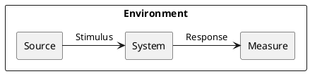

*Stimulus*: condition affecting the system

*Source*: entity generating the stimulus

*Environment*: context under which stimulus occurred (e.g., build, test, deployment, startup, normal operation, overload, failure, attack, change)

*Response*: observable result of the stimulus

*Measure*: benchmark or target value defining a successful response

Pass: 3 scenarios

Good: >3 scenarios

Exceed: >6 scenarios using challenging qualities

}

## Maximum Latency

Quality: _Performance (Latency)_

Scenario: Answers to client requests should be transmitted no more than 100ms after reception of the query

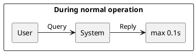

Note that precise numbers in this and other scenarios are based on a very basic understanding on my part of the possibilities involved

## Mutation Visibility

Quality: _Correctness_

Scenario: Changes to tags may take up to 60 min. for full propagation

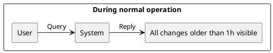

Responsiveness to write queries is not a high priority and may be sacrificed in exchange for performance of read queries or scalability.

{.feedback

This type of Correctness is also known as Read-Write Consistency.

}

## Influence on client data

Quality: _Ethics_

Scenario: Weight of tags and order of result must be based entirely on objective properties of the data (such as creation date) or user-defined criteria. The system may not influence, algorithmically or by admin intervention, the results of a query.

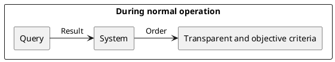

"The algorithm" must not influence results beyond the obvious or explicitly requested manner.

## Intuitiveness of query language

Quality: _Usability_

Scenario: User should succeed in submitting the query they have in mind in less than 3 attempts.

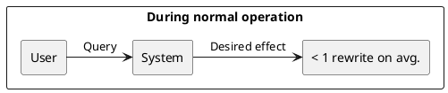

The query language must be learnable quickly

## Failure Mode

Quality: _Safety_

Scenario: System should not return incorrect or incomplete results

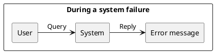

Failures must be transparent - if the user believes an action succeeded, it must truly be so.

## Attack recovery

Quality: _Recoverability_

Scenario: Following a successful attack it should be possible to restore data to a known good state and resume operation within 1 day

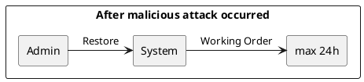

Intrusion must be detected and defeated within a day. Furthermore, logs and backups must be kept to allow rapid restoration of the system to a state it was in before the attacker had access to it.

## DoS attack resilience

Quality: _Availability_

Scenario: System should be able to withstand a targeted denial of service attacks from at least 1000 unique IPs per minute without interrupting operation for regular users

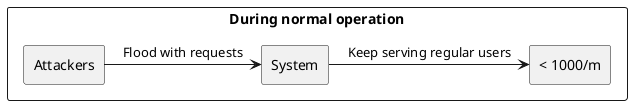

Increased response times and aggressive throttling are unavoidable, but users must not be prevented from making queries completely for attacks below a certain scale.
(Actually I have no idea what scale of attack is realistic, 1000IP/m is a very rough guesstimate)

## User logs

Quality: _Defensibility_

Scenario: System should keep logs of all users and respective write queries.

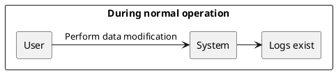

Activity logs help in detection of and recovery from attacks and credential leaks both for our service as a whole and for our clients' individual databases

{.feedback

+ This may also be called Auditability.
+ The Event Sourcing pattern helps to deliver it.

}

# Ex - Quality Attribute Tradeoff

{.instructions

Pick a free combination of two qualities on the [map](https://usi365.sharepoint.com/:x:/s/MSDE-2022-SoftwareArchitecture/ESVksoXVgMNHtKBKrIwatMYBqorOFaKjxnoqssEy0gNPCg?e=81W7SI) and write your name to claim it.

Then write a short text giving an example for the tradeoff in this assignment.

Pass: 1 unique trade-off

Good: 2 trade-offs

Exceed: >2 trade-offs

}

## Privacy vs. Defensibility

Keeping high-detail logs of everything that goes on on your system and everything that your users do is very useful for detecting and defeating intrusions as well as rolling back any changes that an attacker may have made, but it is a raises huge privacy concerns (also confidentiality but I had to choose one)

## Defensibility vs. Simplicity

A simple system is easier to attack - complexity makes it more difficult to find and exploit vulnerabilities. That said, this is a tradeoff that is almost always heavily skewed towards simplicity - as we know, security through obscurity is not feasible. Moreover, simplicity has a lot of benefits on its own. Therefore, when we reduce simplicity to increase defensibility, it is always done in a later step, with a simpler system as a base, using code obfuscation and similar techniques.

## Feasability vs. Usability
(actually affordability vs. accessibility but these two qualities were missing for some reason)

An important aspect of usability is accessibility - systems with low accessibility are extremely unusable for people with impairments. Hence, to increase usability, one must make their systems accessible. However, accessibility is expensive and will significantly increase the time required to develop your product, as well as the cost of doing so.

Note that this tradeoff has already been claimed by somebody else - when I wrote it I wasn't sure if all the tradeoffs had to be unique. For grading purposes, ignore this one.

## Usability and Performance
Usability and performance go hand in hand - a system with bad performance is also unusable
as users become annoyed at waiting times. This effect is especially strong when performance
goes below user reaction speed - i.e. when they are thinking ahead of the program.
When users write or press buttons faster than they are processed, the forced waiting interrupts
their train of thought, worsening not only experience but also function


# Ex - Feature Modeling

{.instructions

In the context of your chosen project domain, describe your domain using a feature model.

The feature model should be correctly visualized using the following template:


If possible, make use of all modeling constructs.

Pass: Include at least 4 non-trivial features

Good: Include at least 6 non-trivial features, which are all implemented by your project

Exceed: Include more than 8 non-trivial features, indicate which are found in your project and which belong to one competitor

}


The root, Queries, Data modification, Access control, Content Tagging and Result presentation features are not optional and implemented by all competitors.
One competitor, Netflix, has an extremely barebones implementation, with no other features added.
Searching around for a bit I managed to find a competitor with a more interesting system to compare to: vndb.org, a database of visual novels. Their tagging system has the following additional features:
 - Computer-readable format
 - Weighted tags
 - Tag aliases
 - Sub-tags/categories
 - Tag attributes e.g. spoiler
 - Tag filter
 - Sorting
 - Client-supplied attributes (except of course they are themselves the client)
 - Paging
 - Variable page size

# Ex - Context Diagram

{.instructions

Prepare a context diagram to define the design boundary for your project.

Here is a PlantUML/C4 example to get started.


Make sure to include all possible user personas and external dependencies you may need.

Pass: 1 User and 1 Dependency

Good: >1 User and >1 Dependency

Exceed: >1 User and >1 Dependency, with both incoming and outgoing dependencies

}

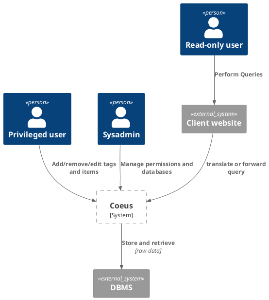


# Ex - Component Model: Top-Down

{.instructions

Within the context of your project domain, represent a model of your modular software architecture decomposed into components.

The number of components in your logical view should be between 6 and 9:

- At least one component should be further decomposed into sub components
- At least one component should already exist. You should plan how to reuse it, by locating it in some software repository and including in your model the exact link to its specification and its price.
- At least one component should be stateful.

The logical view should represent provide/require dependencies that are consistent with the interactions represented in the process view.

The process view should illustrate how the proposed decomposition is used to satisfy the main use case given by your domain model.

You can add additional process views showing how other use cases can be satisfied by the same set of components.

This assignment will focus on modularity-related decisions, we will worry about deployment and the container view later.

Here is a PlantUML example logical view and process view.

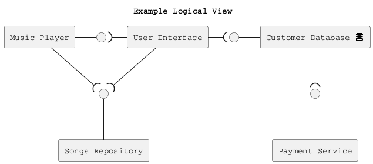

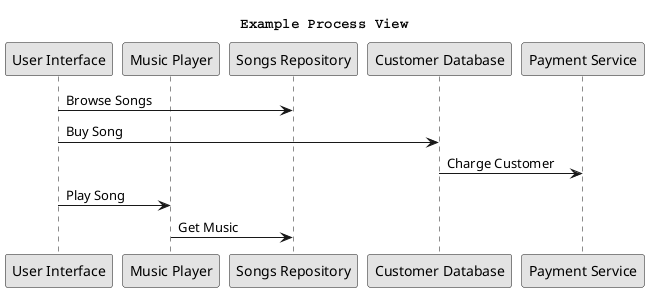

Hint: How to connect sub-components to other external components? Use this pattern.

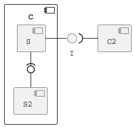

Pass: 6 components (1 decomposed), 1 use case/process view

Good: 6 components (1 decomposed), 2 use case/process view

Exceed: >6 components (>1 decomposed) and >2 use case/process view

}

## Logical View


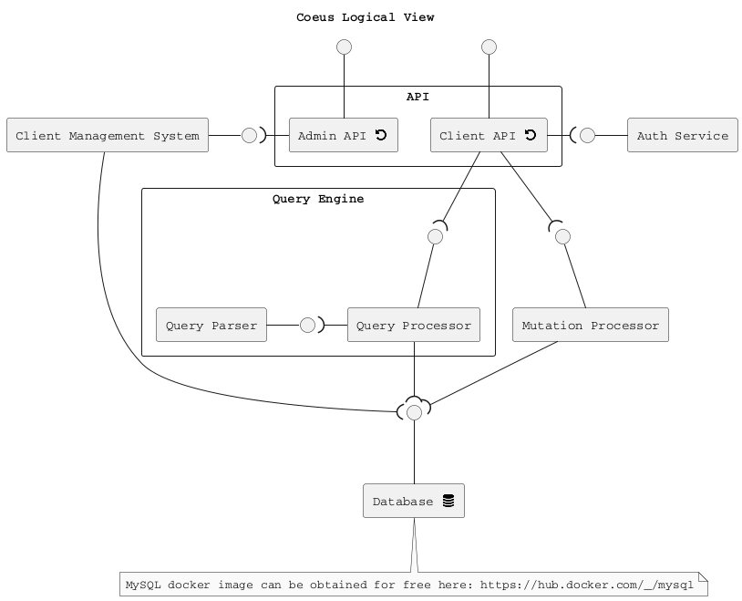


## Process Views

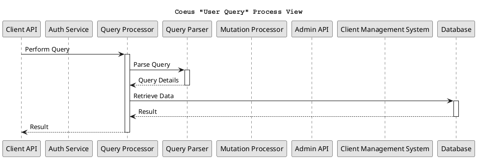

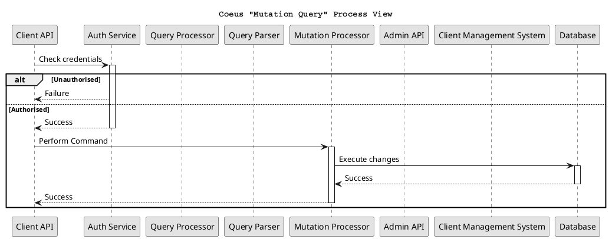

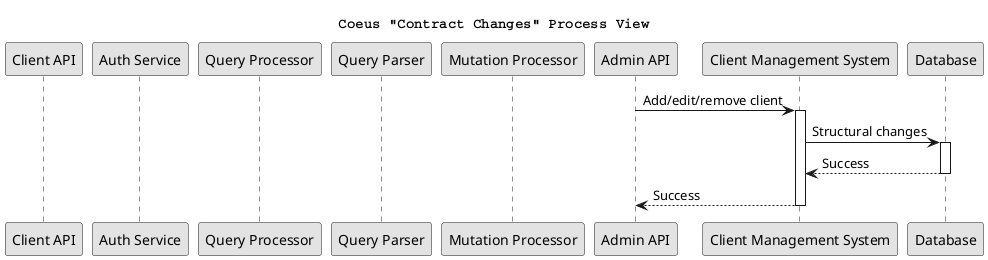


# Ex - Component Model: Bottom-Up

{.instructions

Within the context of your project domain, represent a model of your modular software architecture decomposed into components.

To design this model you should attempt to buy and reuse as many components as possible.

In addition to the logical and process views, you should give a precise list to all sources and prices of the components you have selected to be reused.

Write an ADR to document your component selection process (indicating which alternatives were considered).

Pass: Existing design with at least 1 reused components (1 Logical View, 1 Process View)

Good: Existing design with at least 3 reused components (1 Logical View, 1 Process View, 1 ADR)

Exceed: Redesign based on >3 reused components (1 Logical View, >1 Process View, >1 ADR)

}

Note: if I ever actually do this there's no way in hell I'll use all those things,
but for the sake of the assignment, these are components that could in theory be
reused.

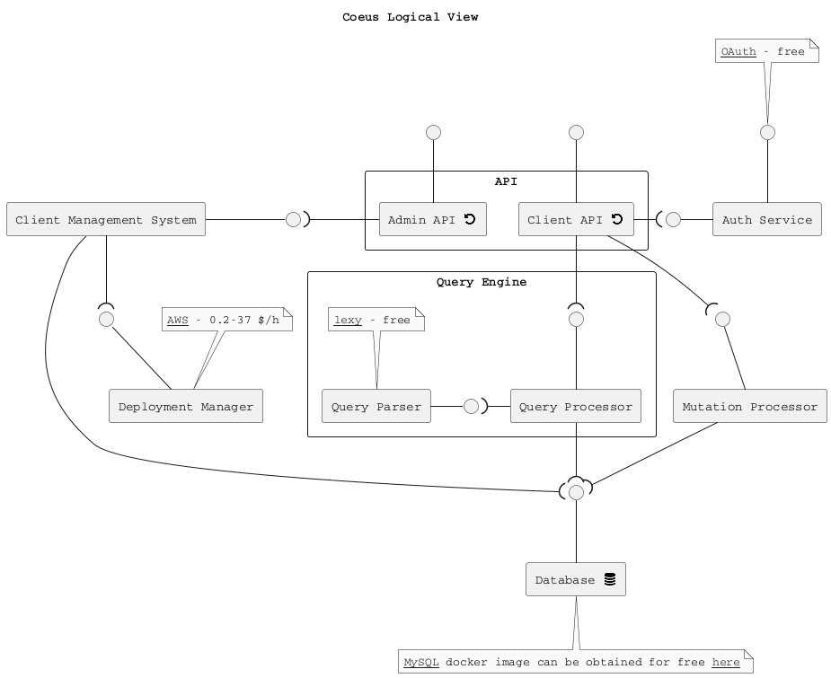

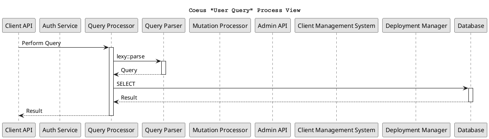

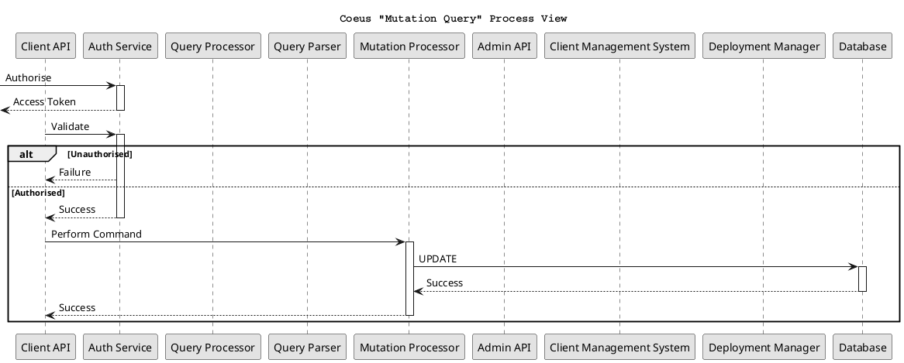

```puml
@startuml
title Coeus "Contract Changes" Process View
autoactivate on

participant "Client API" as CAPI
participant "Auth Service" as AUTH
participant "Query Processor" as PROC
participant "Query Parser" as PARSE
participant "Mutation Processor" as MUT
participant "Admin API" as ADM_API
participant "Client Management System" as ADM
participant "Deployment Manager" as DEP
participant "Database" as DB

ADM_API -> ADM: Add Client\nEdit Client\nRemove Client
opt
ADM -> DEP: RunInstances\nTerminateInstances
return Success
end
ADM -> DB: ALTER SCHEMA\nCREATE DATABASE\nDROP DATABASE
return Success
return  Success

skinparam monochrome true
skinparam shadowing false
skinparam defaultFontName Courier
@enduml
```

1. What did you decide?

## Authentication Protocol: OAuth 2

2. What was the context for your decision?

We have a need to authenticate users. The API for this must be secure, but
easy to use and simple to implement. OAuth is an existing protocol designed for
precisely these criteria. It is also the most popular one out there, meaning
the programmers of our clients are likely used to it and will find it easy
to implement the client side or re-use an existing library for that purpose.
The rest of the project is largely independent of this choice, requiring only
minor changes in the Client API component and an appropriate implementation
in the Auth Service component

3. What is the problem you are trying to solve?

How can we allow users to authenticate in an easy but secure manner?

4.  Which alternative options did you consider?

OAuth, Kerberos, own solution

5. Which one did you choose?

OAuth 2

6. What is the main reason for that?

OAuth is a more popular and widely supported protocol than Kerberos.
Its age and popularity also makes it more robust than a self-designed
protocol is likely to be.

1. What did you decide?

## Parser: Lexy

2. What was the context for your decision?

Our users send us queries to retrieve data - as a string.
In order to filter the data for an appropriate response, the string needs to be
parsed into a format usable by the application. Lexy can be used for that.
The impact of this choice is mainly in performance.

3. What is the problem you are trying to solve?

How can we turn a query string into an object we can use to process data?

4.  Which alternative options did you consider?

Lexy, custom parser

5. Which one did you choose?

Lexy

6. What is the main reason for that?

Lexy is an open-source, freely-available parser which allows specification of
grammars in a convenient C++ DSL.
Using a library instead of building it ourselves saves a lot of work and
provides a guarantee of performance.

Unfortunately, although performance is guaranteed to not be *bad*, it is also
otherwise out of our control, meaning if we find it to be insufficient later on,
we cannot do anything about it.

1. What did you decide?

## Deployment provider: AWS

2. What was the context for your decision?

Given that we decided to run our software ourselves instead of selling it to
clients as a package, we have the need for hardware to run it. A multitenant
architecture means we'd also benefit from a scalable solution and that we can
scale horizontally with little effort.

3. What is the problem you are trying to solve?

Where will we run our software?

4.  Which alternative options did you consider?

AWS, fixed host, self-host

5. Which one did you choose?

AWS

6. What is the main reason for that?

Renting fixed machines from a provider would allow us to run our software at low
cost, but makes it difficult to scale when we need more capacity to accomodate
new or growing clients.

Self-hosting can be very expensive and would likely provide weaker guarantees
on availability and failure recovery than outsourcing.

AWS is rather expensive as hosting goes due to its flexibility, but allows us to
increase and decrease resources programmatically and quickly in response to
client needs.


```puml
@startuml
title Middleware with control flow
'autoactivate on

participant "Frontend" as F2
participant "Frontend" as F
participant "Middleware" as M
participant "Backend" as B
participant "Backend" as B2
actor "admin" as ADMIN

create B
B <- ADMIN
M o<- B
F -> M ++
M --> B ++
M <-- B --
F <- M --

create B2
B2 <- ADMIN
M o<- B2

F -> M ++
M --> B ++

F2 -> M ++
M --> B2 ++
M <-- B2 --
F2 <- M --
M <-- B --
F <- M --

M -> B
destroy B


F -> M ++
M --> B2 ++
M <-- B2 --
F <- M --

M -> B2
destroy B2

skinparam monochrome true
skinparam shadowing false
skinparam defaultFontName Courier
@enduml
```


# Ex - Interface/API Specification

{.instructions

In this iteration, we will detail your previous model to specify the provided interface of all components based on their interactions found in your existing process views.

1. choose whether to use the top down or bottom up model. If you specify the interfaces of the bottom up model, your interface descriptions should match what the components you reuse already offer.

2. decide which interface elements are operations, properties, or events.

Get started with one of these PlantUML templates, or you can come up with your own notation to describe the interfaces, as long as it includes all the necessary details.

The first template describes separately the provided/required interfaces of each component.


The second template annotates the logical view with the interface descriptions: less redundant, but needs the logical dependencies to be modeled to show which are the required interfaces.


Pass: define interfaces of all outer-level components

Good: Define interfaces of all outer-level components. Does your architecture publish a Web API? If not, extend it so that it does.

Exceed: Also, document the Web API using the OpenAPI language. You can use the [OpenAPI-to-Tree](http://api-ace.inf.usi.ch/openapi-to-tree/) tool to visualize the structure of your OpenAPI description.

}

```puml
@startuml
skinparam componentStyle rectangle

!include <tupadr3/font-awesome/database>
!include <tupadr3/font-awesome/undo>

title Coeus Logical View
interface " " as DB_I
    note left of DB_I
    operations:
    ..
    execute(SQL)
    end note
interface " " as MUT_I
    note right of MUT_I
    operations:
    ..
    addItem(udd)
    removeItem(id)
    getItem(id)
    setTag(id, tag, value)
    removeTag(id, tag)
    end note
interface " " as ADM_I
    note top of ADM_I
    operations:
    ..
    addCollection(properties)
    removeCollection(id)
    setProperties(id, properties)
    end note
interface " " as ADM_API_I
    note top of ADM_API_I
    operations:
    ..
    /collections POST
    /collections/{id} DELETE
    /collections/{id} GET
    /collections/(id) PUT
    /users/{name} PUT
    end note
interface " " as CAPI_I
    note top of CAPI_I
    operations:
    ..
    /collections/{id}?q={query} GET
    /collections/{id} POST
    /collections/{id}/{iid} GET
    /collections/{id}/{iid} DELETE
    /collections/{id}/{iid}/{tag} PUT
    /collections/{id}/{iid}/{tag} DELETE
    end note
[Database <$database{scale=0.33}>] as DB
component API {
    [Client API <$undo{scale=0.33}>] as CAPI
    [Admin API <$undo{scale=0.33}>] as ADM_API
}
interface " " as PROC_I
    note right of PROC_I
    operations:
    ..
    execute(query)
    end note
component "Query Engine" {
    [Query Processor] as PROC
    interface " " as PARSE_I
    [Query Parser] as PARSE
}
[Auth Service] as AUTH
[Mutation Processor] as MUT
[Client Management System] as ADM
interface " " as AUTH_I
    note top of AUTH_I
    operations:
    ..
    isValid(token)
    addUser(name)
    end note

DB_I -- DB
PROC_I -- PROC
PARSE - PARSE_I
MUT_I -- MUT
ADM - ADM_I
ADM_API_I -- ADM_API
CAPI_I -- CAPI

PARSE_I )- PROC
CAPI --( PROC_I
PROC --( DB_I
AUTH_I - AUTH
ADM_API -( AUTH_I
CAPI -( AUTH_I
CAPI --( MUT_I
MUT --( DB_I
ADM_I )- ADM_API
ADM --( DB_I

skinparam monochrome true
skinparam shadowing false
skinparam defaultFontName Courier
@enduml
```

openapi specification:
```yaml
openapi: "3.0.2"
info:
  title: Coeus API
  version: "0.1"
paths:
  /adm/collections:
    post:
      description: add a new collection
      responses:
        "200":
          description: OK
        "401":
          description: NOT AUTHORISED
  /adm/collections/{id}:
    put:
      description: edit a collection
      responses:
        "200":
          description: OK
        "401":
          description: NOT AUTHORISED
    get:
      description: get a collection
      responses:
        "200":
          description: OK
        "401":
          description: NOT AUTHORISED
        "404":
          description: NOT FOUND
    delete:
      description: delete a  collection
      responses:
        "200":
          description: OK
        "401":
          description: NOT AUTHORISED
        "404":
          description: NOT FOUND
  /adm/users/{name}:
    put:
      description: add a new user or change their credentials
      responses:
        "200":
          description: OK
        "401":
          description: NOT AUTHORISED
  /collections/{id}:
    get:
      description: perform a query
      parameters:
        - in: query
          name: q
          schema:
            type: string
          description: the query
      responses:
        "200":
          description: OK
        "404":
          description: NOT FOUND
    post:
      description: add a new item
      responses:
        "200":
          description: OK
        "401":
          description: NOT AUTHORISED
        "404":
          description: NOT FOUND
  /collections/{id}/{iid}
    get:
      description: get an item
      responses:
        "200":
          description: OK
        "401":
          description: NOT AUTHORISED
        "404":
          description: NOT FOUND
    delete:
      description: delete an item
      responses:
        "200":
          description: OK
        "401":
          description: NOT AUTHORISED
        "404":
          description: NOT FOUND
  /collections/{id}/{iid}/{tag}:
    put:
      description: add or edit a tag on an item
      responses:
        "200":
          description: OK
        "401":
          description: NOT AUTHORISED
        "404":
          description: NOT FOUND
    delete:
      description: remove a tag from an item
      responses:
        "200":
          description: OK
        "401":
          description: NOT AUTHORISED
        "404":
          description: NOT FOUND
```

Two endpoints missing due to bug in the 'openapi to tree' app:


openapi to tree feedback:
 - It refuses to render the above document unless you comment the `/collections/{id}/{iid}` path
 - The main advantage of a tree structure is that it allows easy representation of
   deeply nested structures, but most APIs are very flat and won't be rendered very well by this.
 - The tool has tooltips, but they do not include any useful information. There should at least
   be the description and non-path parameters
 - If the tool is meant to be used by people new to openapi, better error messages would be nice
 - The colors of the get/post/put/delete markers do not provide enough contrast to the
   text, they should be less saturated
 - Occasionally the editor opens an autocomplete tooltip with no content, which it will never close again

   This can be reproduced by opening a new instance in an incognito window (i.e. with the default text filled in), deleting the content of one of the autocompleted fields (e.g. "get") and quickly writing `po`. The app will open an autocomplete tooltip on `p`, but if the `o` comes quickly enough, it will not manage to close it before the options list becomes empty, which seems to freeze it in place
 - The viewer's zoom controls are too sensitive for macos scrolling (which is usually much more fine-grained than other platforms')

# Ex - Connector View

{.instructions

Extend your existing models introducing the connector view

For every pair of connected components (logical view), pick the most suitable connector. Existing components can play the role of connector, or new connectors may need to be introduced.

Make sure that the interactions shown in the process views reflect the primitives of the selected connector

Pass: model existing connectors based on previous model decisions

Good: model existing connectors based on previous model decisions, write an ADR about the choice of one connector

Exceed: introduce a new type of connector and update your existing process view
(sequence diagram) to show the connector primitives in action

}


Using a new connector QQ (Query Queue) - an N-M connector which allows an arbitrary number of producers and consumers to add tasks to a queue. Producers will create a task and block until it completes. Consumers will pull an available task (which is then marked as "in progress") and, upon completion, produce a result. The result is returned to the producer that created the task, at which point the task is removed from the queue. Tasks that are marked in progress cannot be consumed by another consumer, but upon triggering a timeout, the status is reset (e.g. if the consumer that was working on it crashed). A consumer that attempts to pull a task while the queue
is empty blocks until one is available.

1. What did you decide?

## API/Query Processor connector: Query Queue

2. What was the context for your decision?

The system is required to process a large volume of queries, each of which is
expensive to process, with minimal latency.
Moreover, their availability is critical. If these two components fail, the entire
system is down as they are part of the core service provided.

The outcome of this decision only affects the architecture of the two components involved.

3. What is the problem you are trying to solve?

How can we connect API and Query processor so as to tolerate very high loads?

4.  Which alternative options did you consider?

Procedure call, tuple space, custom connector

5. Which one did you choose?

Custom connector.

6. What is the main reason for that?

Procedure calls are the most basic connectors, but they are direct 1-1 connectors.
To increase the maximum load we can handle we require the ability to use
multiple query engines and at some point perhaps even multiple client APIs
simultaneously.
Procedure calls do not provide this capability.

Tuple spaces provide n-m connectivity and the ability to block until data
is available, but they are not made for synchronous use. A system can be engineered
to make it work, by having the query processor create a tuple for the response
and making the API attempt to read that immediately after publishing the
request tuple, but it is not the intended use of a tuple space and makes it
difficult to extend the connector with extra features like timeouts.

By creating a custom connector (the query queue) we have made a synchronous,
indirect n-m connector with specialised features fit for our purposes.

The cost of developing it (in manpower, time and money) is added to the project,
but will pay off in the long term as using a specialised connector makes development
of client api and query processor easier and its increased power will enhance
the quality of the final product (e.g. by allowing to scale to larger loads)

## Process Views

```puml
@startuml
title Coeus "User Query" Process View

participant "Client API" as CAPI
participant "Auth Service" as AUTH
participant "Query Queue" as QQ
participant "Query Processor" as PROC
participant "Query Parser" as PARSE
participant "Mutation Processor" as MUT
participant "Admin API" as ADM_API
participant "Client Management System" as ADM
participant "Database" as DB

QQ <- PROC: Pull Query
CAPI -> QQ ++: Push Query
QQ --> PROC ++: Query

PROC -> PARSE ++: call Parse(Query)
return Query Details
PROC -> DB ++: SELECT query
return Result
QQ <-- PROC --: Result
CAPI <-- QQ --: Result

skinparam monochrome true
skinparam shadowing false
skinparam defaultFontName Courier
@enduml
```

```puml
@startuml
title Coeus "Mutation Query" Process View
autoactivate off

participant "Client API" as CAPI
participant "Auth Service" as AUTH
participant "Query Queue" as QQ
participant "Query Processor" as PROC
participant "Query Parser" as PARSE
participant "Mutation Processor" as MUT
participant "Admin API" as ADM_API
participant "Client Management System" as ADM
participant "Database" as DB

CAPI -> AUTH ++: call isValid(token)
alt Unauthorised
CAPI <-- AUTH: Failure
else Authorised
'activate PROC
return Success
CAPI -> MUT ++: call addItem(udd)\ncall removeItem(id)\ncall getItem(id)\ncall setTag(id, tag, value)\ncall removeTag(id, tag)
MUT -> DB ++: UPDATE query
return Success
return Success
end

skinparam monochrome true
skinparam shadowing false
skinparam defaultFontName Courier
@enduml
```

```puml
@startuml
title Coeus "Contract Changes" Process View
autoactivate on

participant "Client API" as CAPI
participant "Auth Service" as AUTH
participant "Query Queue" as QQ
participant "Query Processor" as PROC
participant "Query Parser" as PARSE
participant "Mutation Processor" as MUT
participant "Admin API" as ADM_API
participant "Client Management System" as ADM
participant "Database" as DB

ADM_API -> ADM: call addCollection(properties)\ncall removeCollection(id)\ncall setProperties(id, properties)
ADM -> DB: CREATE query\nDELETE query\nUPDATE query
return Success
return Success

skinparam monochrome true
skinparam shadowing false
skinparam defaultFontName Courier
@enduml
```

# Ex - Adapters and Coupling

{.instructions

1. Highlight the connectors (or components) in your existing bottom-up design playing the role of adapter. (We suggest to use the bottom-up design since when dealing with externally sourced components, their interfaces can be a source of mismatches).
2. Which kind of mismatch** are they solving?
3. Introduce a wrapper in your architecture to hide one of the previously highlighted adapters
4. Where would standard interfaces play a role in your architecture? Which standards could be relevant in your domain?
5. Explain how one or more pairs of components are coupled according to different coupling facets
6. Provide more details on how each adapter solves the mismatches identified using pseudo-code or the actual code
7. How can you improve your architectural model to minimize coupling between components? (Include a revised logical/connector view with your solution)

Pass: 1-5 (with one adapter)

Good: 1-6 (with at least two adapters)

Exceed: 1-7 (with at least two adapters)

** If you do not find any mismatch in your existing design we suggest to introduce one artificially.

## Hints

* (1) Should we find cases where two components cannot communicate (and are doing it wrongly) and highlight they would need an adapter?, or cases where we have already a "component playing the role of adapter in the view" and highlight only the adapter?

  *Both are fine. We assumed that if you draw a dependency (or a connector) the interfaces match, but if you detect that the components that should communicate cannot communicate then of course introduce an adapter to solve the mismatch*

* (2) Please show the details about the two interfaces which do not match (e.g., names of parameters, object structures) so that it becomes clear why an adapter is needed and what the adapter should do to bridge the mismatch

* (5-6) These questions are about the implications on coupling based on the decisions you documented in the connector view.
Whenever you have a connector you couple together the components and different connectors will have different forms of coupling

  For example, if you use calls everywhere, do you really need them everywhere? is there some pair of components where you could use a message queue instead?

  Regarding the coupling facets mentioned in question 5. You do not have to answer all questions related to "discovery", "session", "binding", "interaction", "timing", "interface" and "platform" (p.441, Coupling Facets). Just the ones that you think are relevant for your design and by answering them you can get ideas on how to do question 6.

}

1.

There are no adapters in any of my logical views, not even in the bottom-up view since all the existing components talk to my components, never to each other, so my components can be built to accomodate their interface instead of creating a new one.

So I had to invent some:
<ul>
<li>
Imagine the Client API did not offer a REST API but a proprietary solution which offers the following operations (yes I know that's a terrible API. Maybe that's why the adapter is necessary):

 - setActiveCollection(id)
 - [result_ids] query(query)
 - item addItem(id, [tags])
 - item getItem(id)
 - removeItem(item)
 - [tags] getTags(item)
 - setTags(item, tags)

For simplicity we ignore authentication - assume that is either omitted or done before using an undocumented part of the API.
Now a client wants to connect their application which uses the documented REST API with Coeus. An adapter is necessary.
</li>
<li>
The mutation processor is meant to be a bit beefier than that, but we can pretend for the duration of this exercise that it is nothing more than an adapter which translates its operations into sequel queries to run on the database
</li>
</ul>
 2.

 The Client API adapter solves a mismatch between the connector *type* of Client API and the Client as well as a mismatch in the allowed *operations*: the operations of the REST API cannot be mapped directly to those of the proprietary API.

 The Mutation processor also solves a mismatch between connector types, but in its case the operations can be mapped directly (for the purpose of this exercise I'm assuming the schema of the database follows the structure of the application)

 3.

 The mutation processor cannot be hidden inside a wrapper as other components do access the database directly, without going through it, but the client API can be wrapped easily:

 ```puml
 @startuml
 skinparam componentStyle rectangle

 !include <tupadr3/font-awesome/undo>

 title Coeus Client API Wrapper
 interface " " as W_I
     note top of W_I
     operations:
     ..
     /collections/{id}?q={query} GET
     /collections/{id} POST
     /collections/{id}/{iid} GET
     /collections/{id}/{iid} DELETE
     /collections/{id}/{iid}/{tag} PUT
     /collections/{id}/{iid}/{tag} DELETE
     end note
 component "Client API Wrapper" {
     [REST adapter <$undo{scale=0.33}>] as W
     interface " " as CAPI_I
        note right of CAPI_I
        operations:
        ..
        setActiveCollection(id)
        [result_ids] query(query)
        item addItem(id, [tags])
        item getItem(id)
        removeItem(item)
        [tags] getTags(item)
        setTags(item, tags)
        end note
     [Client API] as CAPI
 }

 W_I -- W
 W --( CAPI_I
 CAPI_I -- CAPI

 skinparam monochrome true
 skinparam shadowing false
 skinparam defaultFontName Courier
 @enduml
 ```

 4.

 The SQL database uses a standard interface following the well-known SQL language,
 although caution must be taken since not all databases follow the standard strictly, and most also add non-standard components on top of it.

 Further, the REST APIs, though not themselves a standard make use of other standards (JSON, HTTP...)

 5.

 I will use the connection made through the query queue from the previous exercise as I think it'll make for an interesting and somewhat unusual example.

- Discovery is automatic - the client API simply submits a request without caring who fulfils it. Similarly, the query processor retrieves a request without knowing who it cames from - it is the query queue that decides which instances of the two components are put together.
- The query queue is stateful - although every message from the Client API is independent of the previous messages, the messages from the query processor depend both on the previous messages from the CAPI *and* on the previous messages from the processors.
- The binding is early - the components are hardcoded to depend on each other.
- Interaction is indirect - CAPI and processor never talk to each other directly, only passing messages through the queue.
- Timing, unlike in a regular message queue, is synchronous. The CAPI cannot resume until its request has been fulfilled by an instance of the query processor.
- Both components depend on the Query Queue. If its API-side interface changes, so must the client API. Same for the processor's side. Schema changes most likely involve both sides and require changes in all components. Client API and Query Processor, however, are free to change in any way without affecting the other components as they are not depended on by either the QQ or each other.
- The separation by the query queue allows CAPI and processor to be implemented separately and run on different machines. Even, in fact, multiple instances of the same component can run in parallel using different platforms. The query queue itself must, of course remain standardised. I hadn't thought about the exact method in messages are sent to the QQ when I invented it, but I would envision it as GRPC call or a protobuf message, which means that even if the QQ is deployed on a different platform, the other components are not affected.

6.

Client API - REST adapter:
```cpp
id_t[] get_collections(id, query) {
    setActiveCollection(id);
    return query(query);
}
id_t post_collections(id) {
    setActiveCollection(id);
    id_t item_id = createNewItemId();
    addItem(item_id, {});
    return item_id;
}
tuple<item_t, tag_t[]> get_collections(id, iid) {
    item_t item = getItem(iid);
    tag_t[] tags = getTags(item);
    return {item, tags};
}
void delete_collections(id, iid) {
    item_t item = getItem(iid);
    removeItem(item);
}
void put_collections(id, iid, tag) {
    item_t item = getItem(iid);
    tag_t[] tags = getTags(item);
    tags = tags.append(tag);
    setTags(item, tags);
}
void delete_collections(id, iid, tag) {
    item_t item = getItem(iid);
    tag_t[] tags = getTags(item);
    tags = tags.remove(tag);
    setTags(item, tags);
}
```

Mutation processor adapter:
```sql
addItem(udd)
->
INSERT INTO items VALUES (udf_new_id(), udd.field1, udd.field2, ...)

removeItem(id)
->
DELETE FROM items WHERE item_id = id

getItem(id)
->
SELECT * FROM items, (
    SELECT item_id, GROUP_CONCAT(tag_name + ': ' + tag_value) FROM tags WHERE item_id = id
    GROUP BY item_id
) AS tags WHERE item.item_id = id AND item.item_id = tags.item_id

setTag(id, tag, value)
->
INSERT INTO tags VALUES (id, tag, value)

removeTag(id, tag)
->
DELETE FROM tags WHERE item_id = id AND tag_name = tag
```

7.

I believe I have already minimised coupling among my components. The query queue does it for the most important two, but the others are also in a minimally-coupled state. No components share state and messages are independent from each other wherever reasonable (obviously not in the database). Binding and discovery among components is static, which I believe is reasonable as any components that are bound together are meant to run on the same machine as single instances. The auth service perhaps could be external, although I believe it still makes sense for that to be an RPC, perhaps using grpc, with a destination address in a configuration file. Anything more loose is a security vulnerability.
Timing is synchronous in most cases with direct interactions, but that is necessitated by the performance constraints. It makes no sense to perform an operation to e.g. add a tag when there's nobody to execute it yet - the user is expecting feedback *now*.
The interfaces are all internal so if it is necessary to change one, the other side can be adapted as well (except for the REST APIs, but there's not really a way around it - if the interface changes the clients will have to as well. Hence why interfaces usually don't change. The APIs can easily be extended to support new or changed operations without breaking the previous one though).
Finally, the platform is, by necessity, fixed to be the same for all components. This is again a matter of performance. Due to the need for low-latency responses, we decided to implement everything in cpp running on the same machine. In order to accomodate higher throughput, an exception was made for the CAPI and the query processor, but these are still required to be running in very similar environments physically located close together to minimise performance loss.


# Ex - Physical and Deployment Views

{.instructions

a. Extend your architectural model with the following viewpoints:

1. Physical or Container View

2. Deployment View

Your model should be non-trivial: include more than one physical device/virtual container (or both). Be ready to discuss which connectors are found at the device/container boundaries.

b. Write an ADR about which deployment strategy you plan to adopt. The alternatives to be considered are: big bang, blue/green, shadow, pilot, gradual phase-in, canary, A/B testing.

c. (Optional) Prepare a demo of a basic continuous integration and delivery pipeline for your architectural documentation so that you can obtain a single, integrated PDF with all the viewpoints you have modeled so far.

For example:

- configure a GitHub webhook to be called whenever you push changes to your documentation
- setup a GitHub action (or similar) to build and publish your documentation on a website

Pass: 1 physical view, 1 deployment view, 1 ADR (b.)

Good: >1 physical view, >1 deployment view, 1 ADR (b.)

Exceed: 1 physical view, 1 deployment view, 1 ADR (b.) + 1 demo (c.)

}

Container view:
```puml
@startuml
!include <C4/C4_Container>
!include <C4/C4_Context>
!include <C4/C4_Component>

Person(user_r, "Read-only user", "")
Person(user_w, "Privileged user", "")
Person(user_a, "Sysadmin", "")

System_Boundary(boundary, "Coeus") {
    ContainerDb(db, "Database", "MySQL")
    Container(api, "API", "Docker") {
        Component(capi, "Client API", "C++")
        Component(mut, "Mutation Processor", "C++")
    }
    Container(adm_api, "Management API", "Docker") {
        Component(admapi, "Admin API", "C++")
        Component(cms, "Client Management System", "C++")
    }
    Container(proc, "Processor", "Docker") {
        Component(procc, "Query Processor", "C++")
        Component(pars, "Query Parser", "C++")
    }
    Container(auth, "Authentication Service", "Docker") {
        Component(authc, "Auth Server", "C++")
    }
}

System_Ext(web, "Client website")

Rel(user_r, web, "Perform Queries")
Rel(user_w, api, "Add/remove/edit tags and items")
Rel(user_a, adm_api, "Manage permissions and databases")
Rel(proc, db, "Retrieve", "raw data")
Rel(web, api, "Translate or forward", "query")
Rel(api, proc, "Execute", "query")
Rel(adm_api, db, "Perform structural changes")
Rel(api, db, "Store and update", "raw data")
Rel(api, auth, "Authenticate")
@enduml
```

Deployment view:

I repurposed the C4 notation since I could not find a puml library more
appropriate for deployment views
```puml
@startuml
!include <C4/C4_Container>
!include <C4/C4_Context>
!include <C4/C4_Component>


Boundary(front, "API server") {
    Container(api, "API", "")
    Container(adm_api, "Management API", "")
    Container(auth, "Authentication Service", "")
}

Boundary(mid, "Processor servers") {
    Container(proc, "Processor", "")
}

Boundary(back, "DB server") {
    Container(db, "DBMS", "")
}

Rel(adm_api, db, "TCP/IP")
Rel(proc, db, "TCP/IP")
Rel(api, proc, "RPC")
Rel(api, auth, "HTTPS")
@enduml
```

1. What did you decide?

## Deployment Strategy: Shadow

2. What was the context for your decision?

There are many deployment strategies each with different pros and cons.
Our project is only planned to be deployed on a single instance, but requires
constant availability. This choice will impact the quality of service for our
clients as well as the cost of maintaining the system post-launch.

3. What is the problem you are trying to solve?

How can we deploy our system while maximising availability and minimising risk?

4.  Which alternative options did you consider?

big bang, blue/green, shadow, pilot, gradual phase-in, canary, A/B testing

5. Which one did you choose?

Shadow

6. What is the main reason for that?

Our system only has a backend - a single instance. That means strategies like
gradual phase-in which split the user base over multiple instances make no sense.
Although the system could be duplicated to allow A/B testing over all components
except the database, the usefulness of doing so is very limited considering the
nature of the project (e.g. no user interface). For similar reasons, canary and
pilot are not a good choice.

Big bang, although low-cost, is high-risk as it makes it impossible to revert
changes which break the system. Blue/green solves that problem, but so does shadow
and it has the additional benefit of allowing us to test the new system without
exposing our users to it, so if something breaks we do not lose availability or
data even temporarily. On the other hand, it is a very expensive option,
requiring us to run multiple copies of the whole system, comparing results of the
deployed system with the shadow system, duplicating the db on every release etc.

For this reason we have decided, depending on resource availability, to
allow use of a more limited shadow system - for example running only one or a few
collections on it or using it only for read operations, eliminating the need to
duplicate the database. This decision will be made on a case-by-case basis on
every release.

Another option that we do not plan to implement immediately but are keeping in
mind for future expansion is a sort of canary deployment:
Although the main system will keep its shadow strategy, developers using our
service will appreciate the availability of a sandbox in which they can
experiment with the API and features of our system without needing to use (and buy)
a collection on the main system. If/when we implement such a sandbox, upon developing
new features we will first deploy them in the sandbox. This will allow us to
observe the system in use and fix any bugs we encounter, as well as gather data
on how the new features are being used, which may inform decisions on how
to tweak the features before they are fully released, at which point they become
immutable as we must retain backwards compatibility on the main system.


# Ex - Availability and Services

{.instructions

The goal of this week is to plan how to deliver your software as a service with high availability.

1. If necessary, change your deployment design so that your software is hosted on a server (which could be running as a Cloud VM). Your SaaS architecture should show how your SaaS can be remotely accessed from a client such as a Web browser, or a mobile app
2. Sketch your software as a service pricing model (optional)
3. How would you define the availability requirements in your project domain? For example, what would be your expectation for the duration of planned/unplanned downtimes or the longest response time tolerated by your clients?
4. Which strategy do you adopt to monitor your service's availability? Extend your architecture with a watchdog or a heartbeat monitor and motivate your choice with an ADR.
5. What happens when a stateless component goes down? model a sequence diagram to show what needs to happen to recover one of your critical stateless components
6. How do you plan to recover stateful components? write an ADR about your choice of replication strategy and whether you prefer consistency vs. availability. Also, consider whether event sourcing would help in your context.
7. How do you plan to avoid cascading failures? Be ready to discuss how the connectors (modeled in your connector view) impact the reliability of your architecture.
8. How did you mitigate the impact of your external dependencies being not available? (if applicable)

Pass: 1, 3, 4, one of:  5, 6, 7, 8

Good: 1, 2, 3, 4, two of:  5, 6, 7, 8

Exceed: 1, 2, 3, 4, 5, 6, 7, 8

}

1. Already the case
2. One possibility is load-based pricing: offer plans which allow our clients to
perform a fixed number of queries per unit of payment. E.g. 1000 queries/CHF.
3. Our service is paid for by multiple large companies, therefore we have very high
availability requirements. The damage caused by an unplanned outage is significant.
There should not be any planned outages longer than a few seconds, since our service
is central to our client's services. Response times must not exceed 100ms on average
(we should plan for an expected response time < 40ms*). In exceptional circumstances
response times of up to 1s may be acceptable.
```
Is it possible to notify users of planned maintenance? If your service goes down also your customers are not able to serve their content to their users?
```
4.

```puml
@startuml
skinparam componentStyle rectangle

!include <tupadr3/font-awesome/database>
!include <tupadr3/font-awesome/undo>

title Coeus Logical View
interface " " as DB_I
interface " " as MUT_I
interface " " as ADM_I
interface " " as ADM_API_I
interface " " as CAPI_I
[Database <$database{scale=0.33}>] as DB
component API {
    [Client API <$undo{scale=0.33}>] as CAPI
    [Admin API <$undo{scale=0.33}>] as ADM_API
}
interface " " as PROC_I
component "Query Engine" {
    [Query Processor] as PROC
    interface " " as PARSE_I
    [Query Parser] as PARSE
}
[Auth Service] as AUTH
[Mutation Processor] as MUT
[Client Management System] as ADM
interface " " as AUTH_I

[Watchdog] as WD

DB_I -- DB
PROC_I -- PROC
PARSE - PARSE_I
MUT_I -- MUT
ADM - ADM_I
ADM_API_I -- ADM_API
CAPI_I -- CAPI

PARSE_I )- PROC
CAPI --( PROC_I
PROC --( DB_I
AUTH_I - AUTH
ADM_API -( AUTH_I
CAPI -( AUTH_I
CAPI --( MUT_I
MUT --( DB_I
ADM_I )- ADM_API
ADM --( DB_I

WD --( ADM_API_I
WD --( CAPI_I
WD --( DB_I

skinparam monochrome true
skinparam shadowing false
skinparam defaultFontName Courier
@enduml
```

1. What did you decide?

## Availability Monitor: Watchdog

2. What was the context for your decision?

We need to guarantee availability of our service.
Some of our components are not developed directly by us and cannot be extended
to provide heartbeat monitors.

3. What is the problem you are trying to solve?

How can we effectively monitor availability of our service?

4.  Which alternative options did you consider?

Watchdog, Heartbeat

5. Which one did you choose?

Watchdog

6. What is the main reason for that?

The database and possibly the auth service are not under our control and cannot be
extended with a heartbeat signal. As such we chose to use a watchdog instead.
We can effectively test all components by implementing two new processing paths
in our components which perform dummy actions on their dependencies recursively
to check availability. Then the watchdog needs only ping the admin API and client API
components to obtain availability of all components. The downside of this approach
is that we cannot distinguish whether deeper components (e.g. query parser)
have failed if shallower components (e.g. Client API) have failed, but we consider
that to be acceptable since there it makes no difference whether the processor is
still working if the Client API is gone - either way our service is down.
The watchdog additionally watches the database due to its importance as a
critical component and to reduce the delay in the ping response while it
propagates through the components.
```
Connecting the watchdog with deeper components can help to detect which component had a failure and increase the recovery time.
```
5.

```puml
@startuml
title Coeus "Contract Changes" Process View

participant "Watchdog" as WD
participant "Client API" as CAPI
participant "Auth Service" as AUTH
participant "Query Queue" as QQ
participant "Query Processor" as PROC
participant "Query Parser" as PARSE
participant "Mutation Processor" as MUT
participant "Admin API" as ADM_API
participant "Client Management System" as ADM
participant "Database" as DB

WD -> CAPI+: ping
CAPI -> PROC!!: ping
...some time later...
CAPI -> CAPI: timeout
WD <-- CAPI-: failure
[<- WD: report failure
WD -> PROC **: reboot or reinstantiate


skinparam monochrome true
skinparam shadowing false
skinparam defaultFontName Courier
@enduml
```

6.


1. What did you decide?

## Database Replication: Consistency and availability at the cost of partition tolerance

2. What was the context for your decision?

The database is a central component of our system. Losing it temporarily is
a very expensive outage. Losing any data in it permanently is catastrophic.
It is of the utmost importance that the database is replicated to provide
redundancy. Our model is such that read queries are much more frequent and important
to fulfil than write queries.

3. What is the problem you are trying to solve?

How can we replicate our database while maximising availability and minimising
inconsistency.

4.  Which alternative options did you consider?

No replication, journal only, lockstep replication, asynchronous replication

5. Which one did you choose?

lockstep replication

6. What is the main reason for that?

We decided to replicate our database such that all write queries, which are rare,
shall synchronise the other databases before they commit.
If one replica crashes, the others are fully up-to-date and can continue serving requests
while the crashed one reboots. Once it is online again it can catch up using the journal
produced by the working databases. This allows continued availability without compromising
consistency at the cost of slightly increased processing delay.
It also allows the more important query type, read-only queries, to proceed
in all eventualities as long as at least one replica is still online.

To judge which replicas are offline they rely on the Watchdog. Databases which
cannot contact all replicas check with the watchdog. If the watchdog's alive list
does not match the database's contact list, a ping is triggered and the operation
continues only if the results match. If a database cannot contact either the other replicas
or the watchdog, it considers itself crashed, logs the event and reboots.

In the extremely unlikely event that a replica is working and able to contact the
watchdog but unable to be contacted by the other replicas, the system grounds to a halt,
as tha databases fail to establish consensus.
In the only slightly more likely event that the watchdog is down and cannot be
restarted, *and* a partition occurs among the replicas such that they cannot all
contact each other, a similar situation occurs. In the former case the watchdog
can notice the inconsistency and kill all but the largest partition. In the latter case
human intervention is required. As a way to mitigate, but not solve, this problem,
we can designate one database as the primary. When the watchdog is unavailable,
all databases except the primary will slave themselves to the primary.
Databases which cannot contact the primary refuse connections and kill themselves.
Databases which can contact the primary only commit transactions acknowledged by the primary.
Of course, if both the watchdog and the primary are down, the system still
becomes unavailable (at least to write queries).

Given the failure scenarios described above, we chose this model as it maintains
both availability and consistency in most of the cases. Consistency in particular
is never compromised. Availability could still be increased a little, but only
at the cost of consistency, which we do not consider an acceptable trade-off.

Event sourcing (i.e. journaling) in this context is used to allow recovering
replicas to catch up and become consistent again.
It could also be used as a secondary synchronisation method in the event that
a database is unable to contact a replica but has access to the file system
in which the journal is stored, but that is a rather unlikely event.
It is of further use as an additional backup method to protect against data loss,
particularly in the event not of a failure of storage medium but corruption,
possibly due to an intrusion, but that is beyond the scope of this ADR.

7. Our components are strongly dependent on each other. If one fails, in most cases,
the entire system is down. That said, there are a few partially independent service paths:
If the mutation processor fails, read queries can still proceed and vice-versa.
Similarly, if the client API fails, the admin API remains available.
The other way around too, in theory, although for security reasons that might
be explicitly disallowed. If the database(s) fail(s), the entire service is down
as everything depends on it. This means care must be taken that failures do not
propagate from one component to another, particularly the database and client API.
That said, there is no reason why they should. The database and client API are
run in different containers, and most likely machines, from each other and the
query processor(s) and they communicate over the network using a high-level
protocol, so even if one component hogs all the resources of a machine and sends
out poisoned messages, the other components should not be affected.
Of course the exception to this is if the messages are specifically crafted
to exploit a vulnerability in the targeted component and in the connector between them
(SQL interface if targeting the DB, QQ if targeting the CAPI), but that is unavoidable.

8. The only external dependency we might have is the auth service (we're still
leaving all roads open, so could either create it ourselves, host a component
bought elsewhere or rent it as a service). If it's down, we can't authenticate
our users, which means mutation queries, which must be authenticated, cannot complete.
Read-only queries, however, in most cases do not require authentication, so the
most important part of our service remains unaffected. For the othe queries there
really isn't much we can do. One small mitigation is that we can keep a cache
or recently-used and validated credentials so at least users who were active
shortly before the auth server went down can still access our service.


\* This figure is based on the requirement that network delay should be the dominant
factor in our response time. The US Network Delay Service Level Standard specifies that
as a 36ms roundtrip, so we want to add at most that much processing delay.

# Ex - Scalability

{.instructions

Now that your architecture delivers your software as a service, let's redesign it so that it can scale!

1. Pick one scalability dimension: number of clients, size of input, size of state, number of dependencies

2. How well does your architecture scale along the chosen dimension? Where do you expect the bottleneck to be?

3. Modify your architecture to remove the scalability bottleneck you have identified (show both logical, process and deployment view) - consider whether the API/interface of the bottleneck component should be improved.

4. Write an ADR regarding the scalability pattern you have introduced.

5. Write an ADR regarding the issue of component discovery, choosing one of the alternatives: dependency injection vs. directory. Can you identify an existing component playing the role of directory/dependency injection container? Could you give an example of where you would need to add such component to facilitate dynamic component discovery?

Pass: 1, 2, 3, 5

Good: 1, 2, 3, 4, 5

Exceed: 1, 2, 3, 4, 5 then redo 1, 2, 3 for different scalability dimensions

}

1. Number of clients

2. In the first iteration of the architecture, every component was instantiated only once.
Given the imbalance in the type of queries (#read >> #write >> #admin), and the fact that the API
should be very lightweight and the database is highly optimised to serve large volumes of data,
the bottleneck is the query processor. Due to the performance-oriented design, it should still be
able to tolerate a large number of clients, but it is ultimately limited by virtue of
running on a single machine.

3. For this reason, in assignment 10 (Connector View),
we used a special connector between client API and query processor which would perform
load balancing and allow the query processor to be instantiated multiple times.

The logical view remains the same as the load balancer is abstracted away in the connector.

Process view (simplified - unused components omitted and parser folded into processor):
```puml
@startuml
title Coeus "User Query" Process View

participant "Client API" as CAPI
participant "Query Queue" as QQ
participant "Query Processor" as PROC
participant "Query Processor 2" as PROC2
participant "Database" as DB

activate PROC2

QQ <- PROC: Pull Query
[-> CAPI: Receive query
CAPI -> QQ ++: Push Query
QQ --> PROC ++: Query

[-> CAPI: Receive query
CAPI -> QQ ++: Push Query

...time passes...

PROC2 <-] --: finishes previous query
QQ <- PROC2: Pull Query
QQ --> PROC2 ++: Query

PROC -> DB ++: SELECT query
return Result
QQ <-- PROC --: Result
CAPI <-- QQ --: Result Q1

PROC2 -> DB ++: SELECT query
return Result
QQ <-- PROC2 --: Result
CAPI <-- QQ --: Result Q2

skinparam monochrome true
skinparam shadowing false
skinparam defaultFontName Courier
@enduml
```

One possible deployment view:
```puml
@startuml
!include <C4/C4_Container>
!include <C4/C4_Context>
!include <C4/C4_Component>


Boundary(front, "API server") {
    Container(api, "API", "") {
        Component(capi, "Client API", "")
    }
    Container(adm_api, "Management API", "")
    Container(auth, "Authentication Service", "")
}

Boundary(queue, "QQ server") {
    Container(qq, "Query Queue", "")
}

Boundary(mid, "Processor servers") {
    Container(proc, "Processor", "") {
        Component(cproc, "Query Processor", "")
        Component(cparse, "Query Parser", "")
    }
}

Boundary(back, "DB server") {
    Container(db, "DBMS", "")
}

Rel(adm_api, db, "TCP/IP")
Rel(proc, db, "TCP/IP")
Rel(api, auth, "HTTPS")
Rel(api, qq, "RPC")
Rel(proc, qq, "RPC")
@enduml
```

4.

1. What did you decide?

## Scale to large number of users: by load balancing

2. What was the context for your decision?

We will have potentially large numbers of users querying the system at the same time.
The vast majority of queries are read queries.
The database and API components are efficient\*, but the query processor component
could get overwhelmed.
There is a need to overcome this limitation. Achieving that will require structural changes to the architecture.

\* in fact the query queue also allows instantiation of multiple APIs in case that turns out to be the next bottleneck.

3. What is the problem you are trying to solve?

How can we scale in the number of requests received?

4.  Which alternative options did you consider?

Query queue, caching above the processor, replicating the entire stack (sans db)

5. Which one did you choose?

Query queue

6. What is the main reason for that?

Caching the results of queries in the API component would be a very simple to implement and cost-effective way of alleviating the pressure on the processor, but not very effective. We do not expect a lot of repetition among queries, particularly given the degree of complexity the system is designed to allow, so most queries would result in a cache miss.
While it can be used to supplement other solutions, it is not sufficient on its own.
Another issue with the cache is that its effectiveness depends on usage patterns.
E.g. if a spike is due to a client putting a box near their search bar with advanced usage
options, causing every client to repeat their query a few time as they refine it incrementally,
we suddenly get a large increase in volume of queries while also increasing the uniqueness of queries, against which a cache would be no help.
Another solution is to replicate the entire stack with e.g. a DNS-based load balancer in front. This is an option that requires slightly less work than the query queue as we already have
all the components involved, but it is inefficient. Given that the API has higher capcacity
than the processor, this means the instances of the API would be idle most of the time as
the number of replicas is tuned to the capacity of the processor.
The query queue allows independent scaling of both api and processor, so that each can be maximally utilised, while also increasing flexibility through the implementation of
additional features in the query queue.


5.

1. What did you decide?

## Component discovery: through a directory

2. What was the context for your decision?

The main component which is parallelised is the query processor, but the design of the query queue resolves the need for component discovery.
The QQ is designed in such a way as to also allow parallelisation of the client API, which does need to be discovered by its dependants.
This decision will affect the design of the load balancer.

3. What is the problem you are trying to solve?

How can clients discover the instances of the client API?

4.  Which alternative options did you consider?

Directory, dependency injection

5. Which one did you choose?

Directory

6. What is the main reason for that?

Simply put, using dependency injection is impossible in this context.
The components which need to discover the location of the client API are the users' browsers,
which we cannot control. In fact, we do not even necessarily provide the code
of the program that's running there, as the API is public and anbody could write a client
for it. Hence a directory is our only option. What this means is that every instance of
the client API connects to the nameserver we use and registers itself as an option
for the DNS load balancer (doing this in DNS actually means the API instances have to be very
long-lived as DNS works on rather slow timescales, but if we desire faster turnaround,
the same principle applies to any other load balancer). The DNS server then chooses one among
the possible options when it gets a request, directing the client to the appropriate client API server.
When a server shuts down, it unregisters itself on the nameserver (or if it crashes the watchdog does the same).


1. Size of input/state

2. Our system is designed to support complex queries over large amounts of data, but the current
architecture expects the query processor to perform a single SQL query for the entire operation.
This is not feasible if the database grows too much. Although databases are highly optimised to
run efficiently on large datasets, there is still a limit to what can be done with a single machine.

3.

```puml
@startuml
skinparam componentStyle rectangle

!include <tupadr3/font-awesome/database>
!include <tupadr3/font-awesome/undo>

title Coeus Logical View
interface " " as DBDIR_I
interface " " as DB_I
interface " " as MUT_I
interface " " as CAPI_I
interface " " as ADM_API_I
[Shard Directory] as DBDIR
[Database <$database{scale=0.33}>] as DB
component API {
    [Client API <$undo{scale=0.33}>] as CAPI
    [Admin API <$undo{scale=0.33}>] as ADM_API
}
interface " " as PROC_I
component "Query Engine" {
    [Query Processor] as PROC
    interface " " as PARSE_I
    [Query Parser] as PARSE
}
[Auth Service] as AUTH
interface " " as ADM_I
[Mutation Processor] as MUT
[Client Management System] as ADM
interface " " as AUTH_I

DBDIR_I -- DBDIR
DB_I -- DB
PROC_I -- PROC
PARSE - PARSE_I
MUT_I -- MUT
ADM_I -- ADM
ADM_API_I -- ADM_API
CAPI_I -- CAPI

PARSE_I )- PROC
CAPI --( PROC_I
PROC --( DBDIR_I
PROC --( DB_I
AUTH -- AUTH_I
AUTH_I )-- ADM_API
AUTH_I )-- CAPI
CAPI --( MUT_I
MUT --( DBDIR_I
MUT --( DB_I
ADM_API --( ADM_I
ADM --( DBDIR_I
ADM --( DB_I

skinparam monochrome true
skinparam shadowing false
skinparam defaultFontName Courier
@enduml
```

Simplified process view - unused components omitted and QQ/QP abstracted away:
```puml
@startuml
title Coeus "User Query" Process View

participant "Client API" as CAPI
participant "Query Engine" as PROC
participant "Shard Directory" as DBDIR
participant "Database Shard 1" as DB1
participant "Database Shard 2" as DB2
participant "Database Shard 3" as DB3

autoactivate on

CAPI -> PROC: Query
PROC -> DBDIR: Retrieve locations
return Data Locations
PROC -> DB1: Subquery #1
PROC -> DB2: Subquery #1
PROC -> DB3: Subquery #1
return Partial result
return Partial result
return Partial result
PROC -> PROC: aggregate
return Result
return Result

skinparam monochrome true
skinparam shadowing false
skinparam defaultFontName Courier
@enduml
```


One possible deployment view (QQ omitted because puml makes a mess out of components
    which are supposed to be middleware but only have incoming edges):
```puml
@startuml
!include <C4/C4_Container>
!include <C4/C4_Context>
!include <C4/C4_Component>


Boundary(front, "API server") {
    Container(api, "API", "") {
        Component(capi, "Client API", "")
    }
    Container(adm_api, "Management API", "")
    Container(auth, "Authentication Service", "")
}

Boundary(mid, "Processor servers") {
    Container(proc, "Processor", "") {
        Component(cproc, "Query Processor", "")
        Component(cparse, "Query Parser", "")
    }
}

Boundary(back, "DB servers") {
    Container(db, "Database", "") {
        Component(cdb, "DBMS", "")
    }
}

Boundary(dir, "Directory server") {
    Container(dbdir, "Shard Directory", "") {
        Component(cdbdir, "Shard Directory", "")
    }
}

Rel(adm_api, db, "TCP/IP")
Rel(adm_api, dbdir, "RPC")
Rel(proc, db, "TCP/IP")
Rel(proc, dbdir, "RPC")
Rel(api, auth, "HTTPS")
Rel(api, proc, "RPC")
@enduml
```


# Ex - Flexibility

{.instructions

Only dead software stops changing. You just received a message from your customer, they have an idea. Is your architecture ready for it?

1. Pick a new use case scenario. Precisely, what exactly do you need to change of your existing architecture so that it can be supported? Model the updated logical/process/deployment views.

2. Pick another use case scenario so that it can be supported without any major architectural change (i.e., while you cannot add new components, it is possible to extend the interface of existing ones or introduce new dependencies). Illustrate with a process view, how your previous design can satisfy the new requirement.

3. Change impact. One of your externally sourced component/Web service API has announced it will introduce a breaking change. What is the impact of such change? How can you control and limit the impact of such change? Update your logical view

4. Open up your architecture so that it can be extended with plugins by its end-users. Where would be a good extension point? Update your logical view and give at least one example of what a plugin would actually do.

5. Assuming you have a centralized deployment with all stateful components storing their state in the same database, propose a strategy to split the monolith into at least two different microservices. Model the new logical/deployment view as well as the interfaces of each microservice you introduce.

Pass: 1, one out of 2-5.

Good: 1, two out of 2-5.

Exceed: 1-5.

}

1. We consider the case in which clients are not willing to let us store the data
ourselves (maybe for legal reasons, e.g. we're based in europe and they need to
follow some law according to which they may not export or store data outside
of the USA). That means our systems, upon receiving a query, must contact their
database to satisfy it.
So the query processor, mutation processor and client management system need to
choose between and contact (directly or indirectly) either our database or one
of our clients'.

To support this use case we modify our logical view as follows:
```puml
@startuml
skinparam componentStyle rectangle

!include <tupadr3/font-awesome/database>
!include <tupadr3/font-awesome/undo>

title Coeus Logical View
interface " " as DB_I
interface " " as MUT_I
interface " " as ADM_I
interface " " as ADM_API_I
interface " " as CAPI_I
[Database <$database{scale=0.33}>] as DB
interface " " as DBMNG_I
[Data Manager] as DBMNG
interface " " as EXTDB_I
[External Databases] as EXTDB
component API {
    [Client API <$undo{scale=0.33}>] as CAPI
    [Admin API <$undo{scale=0.33}>] as ADM_API
}
interface " " as PROC_I
component "Query Engine" {
    [Query Processor] as PROC
    interface " " as PARSE_I
    [Query Parser] as PARSE
}
[Auth Service] as AUTH
[Mutation Processor] as MUT
[Client Management System] as ADM
interface " " as AUTH_I

PROC_I -- PROC
PARSE - PARSE_I
MUT_I -- MUT
ADM - ADM_I
ADM_API_I -- ADM_API
CAPI_I -- CAPI
DB_I - DB

EXTDB_I -- EXTDB
DBMNG_I - DBMNG

PARSE_I )- PROC
CAPI --( PROC_I
PROC --( DBMNG_I
AUTH_I - AUTH
ADM_API -( AUTH_I
CAPI -( AUTH_I
CAPI --( MUT_I
MUT --( DBMNG_I
ADM_I )- ADM_API
ADM --( DBMNG_I

DBMNG -( DB_I
DBMNG --( EXTDB_I

skinparam monochrome true
skinparam shadowing false
skinparam defaultFontName Courier
@enduml
```

Simplified process view - unused components omitted and QQ/QP abstracted away:
```puml
@startuml
title Coeus "User Query" Process View

participant "Client API" as CAPI
participant "Query Engine" as PROC
participant "Data Manager" as DBMNG
participant "Database" as DB
participant "External Database" as EXTDB

autoactivate on

CAPI -> PROC: Query
PROC -> DBMNG: Translated Query

alt Data is locally available
DBMNG -> DB: Translated Query
return Result
else Data is remote
DBMNG -> EXTDB: Translated Query
return Result
end

return Result
return Result

skinparam monochrome true
skinparam shadowing false
skinparam defaultFontName Courier
@enduml
```

One possible deployment view (QQ omitted because puml makes a mess out of components
    which are supposed to be middleware but only have incoming edges):
```puml
@startuml
!include <C4/C4_Container>
!include <C4/C4_Context>
!include <C4/C4_Component>


Boundary(front, "API server") {
    Container(api, "API", "") {
        Component(capi, "Client API", "")
    }
    Container(adm_api, "Management API", "")
    Container(auth, "Authentication Service", "")
}

Boundary(mid, "Processor servers") {
    Container(proc, "Processor", "") {
        Component(cproc, "Query Processor", "")
        Component(cparse, "Query Parser", "")
    }
}

Boundary(back, "DB servers") {
    Container(dbmng, "Data Manager", "") {
        Component(cdbmng, "Data Manager", "")
    }

    Container(db, "Database", "") {
        Component(cdb, "DBMS", "")
    }
}

Boundary(cloud, "The Cloud")

Rel(adm_api, dbmng, "RPC")
Rel(proc, dbmng, "RPC")
Rel(api, auth, "HTTPS")
Rel(api, proc, "RPC")
Rel(dbmng, cloud, "TCP/IP")
Rel(dbmng, db, "TCP/IP")
@enduml
```

2. We consider the case in which a rogue developer designed a backdoor which would allow
some users to execute mutations without authenticating.

```puml
@startuml
title Coeus "User Query" Process View

participant "Client API" as CAPI
participant "Auth Service" as AUTH
participant "Mutation Processor" as PROC
participant "Database" as DB

autoactivate on

[-> CAPI: Query
opt Backdoor not triggered
CAPI -> AUTH: Authentication credentials
return Success
end

CAPI -> PROC: Query
PROC -> DB: Translated Query
return Result
return Result
return Result

skinparam monochrome true
skinparam shadowing false
skinparam defaultFontName Courier
@enduml
```

3. The only external component in the system is the auth service, so we
consider the scenario in which the auth service's interface changes and we
cannot afford to rewrite the admin API and client API accordingly.

Hence we decide to build an adapter between our systems and the external component
to maintain the illusion of the old interface.

```puml
@startuml
skinparam componentStyle rectangle

!include <tupadr3/font-awesome/database>
!include <tupadr3/font-awesome/undo>

title Coeus Logical View
interface " " as DB_I
interface " " as MUT_I
interface " " as ADM_I
interface " " as ADM_API_I
interface " " as CAPI_I
[Database <$database{scale=0.33}>] as DB
component API {
    [Client API <$undo{scale=0.33}>] as CAPI
    [Admin API <$undo{scale=0.33}>] as ADM_API
}
interface " " as PROC_I
component "Query Engine" {
    [Query Processor] as PROC
    interface " " as PARSE_I
    [Query Parser] as PARSE
}
interface " " as AUTH_AD_I
[Auth Adapter] as AUTH_AD
interface " " as AUTH_I
[Auth Service] as AUTH
[Mutation Processor] as MUT
[Client Management System] as ADM

DB_I -- DB
PROC_I -- PROC
PARSE - PARSE_I
MUT_I -- MUT
ADM - ADM_I
ADM_API_I -- ADM_API
CAPI_I -- CAPI
AUTH_I - AUTH
AUTH_AD_I - AUTH_AD

PARSE_I )- PROC
CAPI --( PROC_I
PROC --( DB_I
ADM_API -( AUTH_AD_I
CAPI -( AUTH_AD_I
CAPI --( MUT_I
MUT --( DB_I
ADM_I )- ADM_API
ADM --( DB_I
AUTH_AD -( AUTH_I

skinparam monochrome true
skinparam shadowing false
skinparam defaultFontName Courier
@enduml
```

4. We consider the scenario in which we permit user-defined extensions to the query parser
to increase its power or permit the use of custom syntax.

That means the query parser would need to accept registration of new components, which it
will then call upon receiving a query to process.

An example plugin is one that translates a query from google-like "bag of words" syntax to
our own language to accomodate users who are more used to that.
e.g. it would turn `dark fantasy female protagonist "no romance" OR "low romance" watchtime > 100` into `"dark fantasy" AND "female protagonist" AND ("no romance" OR "low romance") AND watchtime(100..)`*

*actually we foresee already supporting the most commonly found syntaxes, but the same
could be done for more niche languages which we might not support yet.

```puml
@startuml
skinparam componentStyle rectangle

!include <tupadr3/font-awesome/database>
!include <tupadr3/font-awesome/undo>

title Coeus Logical View
interface " " as DB_I
interface " " as MUT_I
interface " " as ADM_I
interface " " as ADM_API_I
interface " " as CAPI_I
[Database <$database{scale=0.33}>] as DB
component API {
    [Client API <$undo{scale=0.33}>] as CAPI
    [Admin API <$undo{scale=0.33}>] as ADM_API
}
interface " " as PROC_I
component "Query Engine" {
    [Query Processor] as PROC
    interface " " as PARSE_I
    [Query Parser] as PARSE
}
interface " " as PLUG_I
[Parser Plugins] as PLUG
interface " " as AUTH_I
[Auth Service] as AUTH
[Mutation Processor] as MUT
[Client Management System] as ADM

DB_I -- DB
PROC_I -- PROC
PARSE_I - PARSE
MUT_I -- MUT
ADM - ADM_I
ADM_API_I -- ADM_API
CAPI_I -- CAPI
AUTH_I - AUTH
PLUG_I - PLUG

PROC -( PARSE_I
CAPI --( PROC_I
PROC --( DB_I
ADM_API -( AUTH_I
CAPI -( AUTH_I
CAPI --( MUT_I
MUT --( DB_I
ADM_I )- ADM_API
ADM --( DB_I

PARSE -( PLUG_I

skinparam monochrome true
skinparam shadowing false
skinparam defaultFontName Courier
@enduml
```

5. Our application is already a microservice. That was mostly the premise of the whole thing:
Other companies have monolithic applications with integrated tagging systems.
Due to their monolithic nature, they end up having significant flaws in their tagging
system, hence we propose the creation of a (micro-) service they can rent instead.

As such, the entire architecture is built around satisfaction of a single task
and every component works on the same state, making it impossible to split any further.
